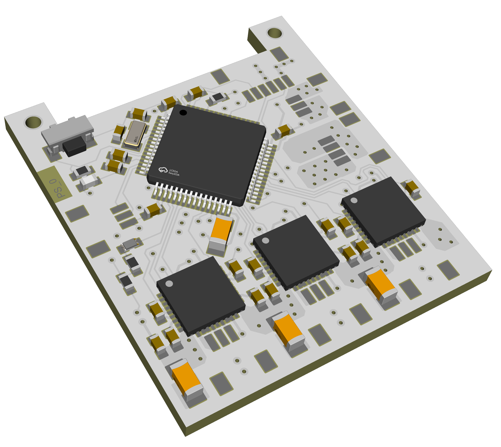
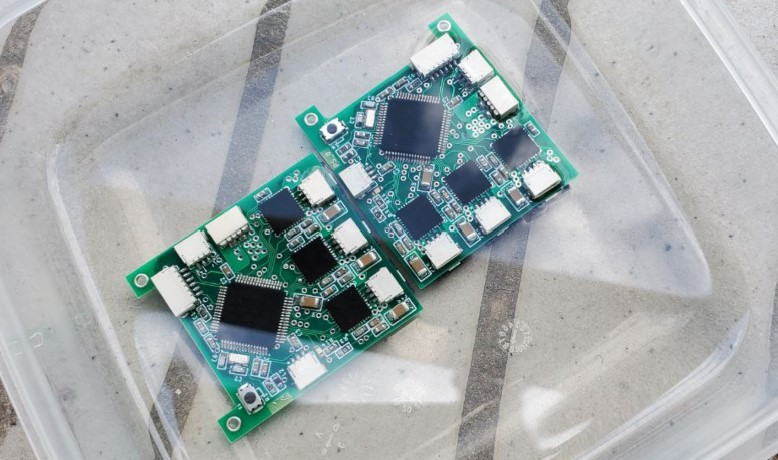
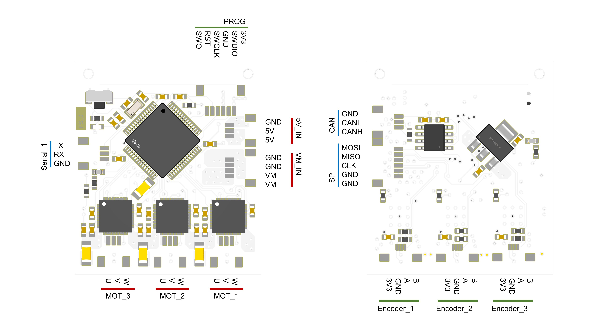

# TinyFOC_triple

   
   

* Compact 3 channel brushless motor driver with external encoder
* Supports I2C (AS5600) or AB (TLE5012B) encoders
* Hardwarer CAN, serial, SPI interface
* Input voltage: 9v - 24v, maximum phase current 1.5A
* 4 layer board / FR4 / 1.0mm thickness
* [SimpleFOC](https://github.com/simplefoc) compatible

Design file exported with [Autodesk EAGLE](https://www.autodesk.com/products/eagle/overview?term=1-YEAR&tab=subscription)

## ICs
* MCU [STM32F446RET6](https://www.st.com/en/microcontrollers-microprocessors/stm32f446re.html)
* Motor driver [DRV8313](https://www.ti.com/product/DRV8313?utm_source=google&utm_medium=cpc&utm_campaign=asc-null-null-GPN_EN-cpc-pf-google-wwe&utm_content=DRV8313&ds_k=DRV8313&DCM=yes&gclid=EAIaIQobChMIroSGo5PH_gIV7TatBh0lfQ1tEAAYASAAEgJeRvD_BwE&gclsrc=aw.ds)
* Encoder [AS5600](https://ams.com/en/as5600) or [TLE5012B E1000](https://www.infineon.com/cms/en/product/sensor/magnetic-sensors/magnetic-position-sensors/angle-sensors/tle5012b-e1000/)

## Pin Out
   

## License
MIT License

## Contact
* Shuang Peng, {shuangpe}@usc.edu
